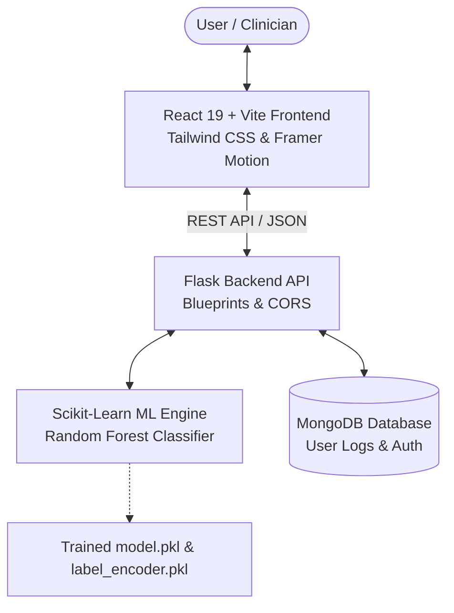

# 🧠 Bipolar Episode Forecasting & Monitoring System

[](https://bipolar-forcasting.netlify.app/)
[](https://react.dev/)
[](https://flask.palletsprojects.com/)
[](https://scikit-learn.org/)
[](https://www.mongodb.com/)

An AI-powered full-stack health intelligence platform engineered to predict, monitor, and forecast bipolar mood episodes using longitudinal behavioral, physiological, and psychological markers. By leveraging machine learning classification and temporal pattern analysis, the system provides proactive early-warning insights for mania, depression, and stability.

🔗 **Live Application Preview:** [https://bipolar-forcasting.netlify.app/](https://bipolar-forcasting.netlify.app/)

---

> ⚠️ **Clinical & Medical Disclaimer:** This project is designed strictly for research, educational, and personal tracking purposes. It is **not** a certified medical diagnostic instrument, nor is it a substitute for professional clinical evaluation, psychiatric diagnosis, or therapeutic treatment.

---

## 🌟 Key Features

* 🔮 **AI Episode Prediction & Risk Scoring:**
  * Powered by a trained **Random Forest Classifier** assessing multi-dimensional behavioral parameters.
  * Real-time risk probability calculation for **Mania**, **Depression**, and **Euthymia (Stability)**.
* 📈 **Interactive Health Dashboard:**
  * Dynamic visual health cards, mood stability gauges, and sleep-energy correlations.
  * Real-time metrics computed directly from user log history.
* 🗓️ **Temporal Forecast Explorer:**
  * Longitudinal trend modeling analyzing up to 28 days of historical data.
  * Multi-week risk trajectory mapping and future episode outlook.
* 📝 **Multi-Factor Behavioral Logging:**
  * Comprehensive daily check-ins tracking mood, sleep duration, physical activity, social interaction, energy levels, and optimism score.
* 💬 **AI Mental Health Companion:**
  * Integrated conversational support interface offering supportive guidance, mood reflections, and grounding exercises.
* 🔐 **Secure Authentication & Customization:**
  * User profile management, personalized emergency contact setups, notification preferences, and persistent local session states.

---

## 🏗️ System Architecture



---

## 🛠️ Tech Stack

### Frontend
* **Framework:** React 19 + Vite
* **Styling & Motion:** Tailwind CSS, Framer Motion
* **Visualizations:** Recharts
* **Icons:** Lucide-React
* **Routing:** React Router DOM v7
* **Deployment:** Netlify

### Backend & API
* **Runtime:** Python 3.9+
* **Framework:** Flask (Modular Blueprints architecture)
* **API Middleware:** Flask-CORS
* **Production Server:** Gunicorn

### Machine Learning & Data Science
* **Core Library:** Scikit-learn
* **Algorithm:** Random Forest Classifier (Multi-class mood state classification)
* **Data Processing:** Pandas, NumPy
* **Feature Engineering:** One-Hot Encoding, Label Encoding, string extraction
* **Model Serialization:** Pickle (`model.pkl`, `label_encoder.pkl`)

### Database
* **Primary DB:** MongoDB (via PyMongo)

---

## 📁 Project Directory Structure

```
Bipolar-Episode-Forecasting-Project/
├── bipolar-frontend/               # React 19 Frontend Application
│   ├── src/
│   │   ├── components/             # Reusable UI & Page Components
│   │   │   ├── Dashboard.jsx       # Real-time analytics dashboard
│   │   │   ├── ForecastExplorer.jsx# Temporal trend analyzer & forecasting
│   │   │   ├── MoodLogs.jsx        # Daily log submissions & history
│   │   │   ├── ChatArea.jsx        # AI conversational companion
│   │   │   ├── Welcome.jsx         # Landing & onboarding view
│   │   │   ├── Login.jsx           # Authentication interface
│   │   │   ├── Settings.jsx        # User preferences & emergency contacts
│   │   │   ├── Sidebar.jsx         # Navigation sidebar
│   │   │   └── Topbar.jsx          # Header with user controls
│   │   ├── App.jsx                 # Route management & layout wrapper
│   │   ├── config.js               # API URL & client configuration
│   │   └── index.css               # Global styling
│   ├── package.json
│   └── vite.config.js
│
├── bipolar-backend/                # Flask Backend & ML Engine
│   ├── routes/                     # Modular API Blueprints
│   │   ├── auth_routes.py          # User registration & authentication
│   │   ├── dashboard_routes.py     # Aggregated stats & dashboard data
│   │   ├── forecast_routes.py      # Multi-day forecasting engine
│   │   ├── logs_routes.py          # Daily log CRUD endpoints
│   │   └── predict_routes.py       # Instant ML inference endpoint
│   ├── app.py                      # Flask Application Factory
│   ├── config.py                   # Environment & Database config
│   ├── database.py                 # MongoDB connection manager
│   ├── ml_service.py               # ML inference & pipeline utilities
│   ├── train_model.py              # Model training & evaluation script
│   ├── bipolar_dataset.csv         # Clinical / behavioral dataset
│   ├── model.pkl                   # Trained Random Forest model
│   ├── label_encoder.pkl           # Target label encoder
│   ├── Procfile                    # Production process file
│   └── requirements.txt            # Python dependencies
│
├── netlify.toml                    # Netlify deployment configuration
└── README.md                       # Documentation
```

---

## 📌 REST API Specification

### 🔐 Authentication (`/api`)
| Method | Endpoint | Description |
| :--- | :--- | :--- |
| `POST` | `/api/register` | Register a new user profile |
| `POST` | `/api/login` | Authenticate user and initialize session |

### 📊 Logs & Predictions (`/api`)
| Method | Endpoint | Description |
| :--- | :--- | :--- |
| `GET` | `/api/logs` | Fetch user check-in history |
| `POST` | `/api/logs` | Submit a new daily multi-factor log |
| `POST` | `/api/predict` | Run instant ML model inference on raw behavioral features |

### 📈 Dashboard & Longitudinal Forecasting (`/api`)
| Method | Endpoint | Description |
| :--- | :--- | :--- |
| `GET` | `/api/dashboard` | Get latest summary statistics, risk scores, and sleep averages |
| `GET` | `/api/forecast` | Retrieve multi-week risk forecast and trajectory analytics |
| `GET` | `/` | API health check status |

---

## ⚡ Getting Started Locally

### Prerequisites
* **Node.js** (v18+) & **npm**
* **Python** (v3.9+)
* **MongoDB** (Local instance or MongoDB Atlas connection string)

---

### 1️⃣ Backend Setup

1. Navigate to the backend folder:
   ```bash
   cd bipolar-backend
   ```
2. Create and activate a virtual environment:
   ```bash
   # Windows
   python -m venv venv
   .\venv\Scripts\activate

   # macOS / Linux
   python3 -m venv venv
   source venv/bin/activate
   ```
3. Install Python dependencies:
   ```bash
   pip install -r requirements.txt
   ```
4. (Optional) Retrain the Machine Learning model:
   ```bash
   python train_model.py
   ```
5. Launch the Flask API server:
   ```bash
   python app.py
   ```
   *The backend will be running at `http://127.0.0.1:5000`*

---

### 2️⃣ Frontend Setup

1. Open a new terminal and navigate to the frontend folder:
   ```bash
   cd bipolar-frontend
   ```
2. Install npm packages:
   ```bash
   npm install
   ```
3. Start the Vite development server:
   ```bash
   npm run dev
   ```
   *The frontend will be available at `http://localhost:5173`*

---

## 🌐 Deployment

* **Frontend:** Deployed on [Netlify](https://bipolar-forcasting.netlify.app/) with Single-Page Application (SPA) redirect rules defined in `netlify.toml`.
* **Backend:** Configured for cloud container/PaaS deployment with Gunicorn entry point specified in `Procfile`.

---

## 👨‍💻 Author

**Bhavya Kanojia**  
* B.Tech Computer Science & Engineering, IILM University  
* Focus: Applied AI/ML Systems & Full-Stack Web Architecture  
* GitHub: [@XxBHAVYAxX](https://github.com/XxBHAVYAxX)

---

## 📄 License

This project is open source and distributed under the [MIT License](LICENSE).
